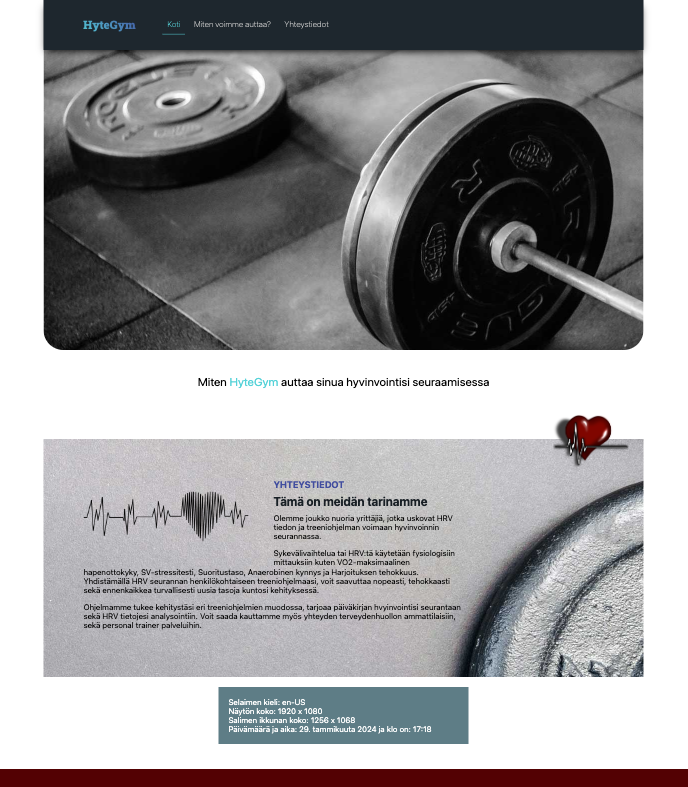
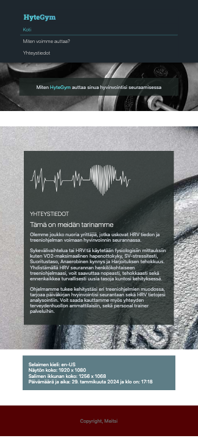

# Vite perusteet ja responsiivisuus

Asennetaan ensin vite, HUOM luo tätä projektia varteb **uusi tyhjä kansio** (esim. FE) erillään back-end projektista. FE ja BE elävät siis omissa projekteissaan:

### Setting up Vite for front-end (client) development

[Vite](https://vitejs.dev/guide/)

1. Create a new project with Vite in terminal

   ```sh
   # cd to your code folder
   npm create vite@latest
   # 1. type your project name
   # 2. Select a framework: -> Vanilla
   # 3. Select a variant: -> Javascript
   cd <project-name>
   npm install
   # start vite dev server
   npm run dev
   ```

1. Open the preview URL (<http://localhost:5173/>) in your browser and open developer tools (e.g. Chrome & [Chrome DevTools](https://developers.google.com/web/tools/chrome-devtools/))
1. Open the project folder in VS Code
1. To get started with a clean web app template:
   - edit or replace `index.html` file but do not remove `<script type="module" src="/main.js"></script>`
   - edit or replace `style.css` with your own styles
   - edit `main.js` file (note that the css file is imported in the js file instead of the html file `import './style.css';`). Everything else boilerplate code can be removed from the js file.
   - remove `counter.js` and image files because they are just examples

#### Publishing the website created with Vite

1. Stop the dev server (_ctrl-c_) if running
1. [Build](https://vitejs.dev/guide/build) the application `npm run build`

   - If you have more html files than just `index.html`, you need to add them to [configuration](https://vitejs.dev/guide/build#multi-page-app). Create a file called `vite.config.js` into your project's root folder:

   ```js
   // vite.config.js
   import { resolve } from 'path';
   import { defineConfig } from 'vite';

   export default defineConfig({
   	build: {
   		rollupOptions: {
   			input: {
   				// List your html files here, e.g:
   				main: resolve(__dirname, 'index.html'),
   				home: resolve(__dirname, 'home.html'),
   			},
   		},
   	},
   	base: './',
   });
   ```

1. Copy all contents of `dist/` folder to the web server's public folder
   <br>

### Prettier

Lisää nyt projektin juureen prettier konfiguraatiotidosto, aivan kuten BE puolella.

[Prettier](https://prettier.io/)

```javascript
// sample .prettierrc.cjs
module.exports = {
	semi: true,
	singleQuote: true,
	bracketSpacing: false,
	singleQuote: true,
	trailingComma: 'all',
};
```

# Responsiivinen suunnittelu, perusteet

Käydään perusasiat ensin läpi luennon kautta:

1. [Responsiivinen suunnittelu, ppt](https://docs.google.com/presentation/d/1_lgctjnQ9ktsoBKFvkcBd43cN8EuTQ6IhVtmW6ttTss/edit?usp=sharing)

<br>

Teemme tunneilla perusharjoituksia ja mediasääntöjä ihan uuteen tyhjään html pohjaan, vite serveriin, joten et tarvitse luentojen aikana muuta valmista koodia. Linkit joita käyn demon aikana läpi löytyy readme tiedostosta ja täältä: [Responsiivinen suunnittelu, LINKIT](03-linkkejä.md)

# Testijulkaisu verkkolevylle

Julkaise reponsiivinen sivusi yllä olevien vite ohjeiden mukaan ja siirrä dist kansion sisältö verkkolevyllesi. Testaa että kaikki toimii kuten pitää.

# Tehtävät sivuston pohjaan

Sivustojasi EI tarvitse vielä siirtää vite serverille. Teemme tämän ensi viikolla. Voit halutessasi kuitenkin siirtää sivusi jo valmiiksi vite ympäristöön.

### Tehtävä 1 - Responsiivinen Banner/Hero kuva

Lisää sivuillesi responsiivinen Banner/Hero kuva. Yritä tässä käyttää CSS Background ominaisuutta ja sovittaa kuva mahdollisimman mukautuvaksi alueeseen.



### Tehtävä 2 - Media Queries / Mediakyselyt

Lisää sivuillesi muutama breakpoint jossa muutat sisältöä sopimaan paremmin kyseiseen näyttökokoon. Joudut nyt katsomaan kokonaisuutta "content first" ajattelutavalla. Tee breakpointit niihin kohtiin, missä sisältö menee rikki tai tarvii korjailua.

- [Media Queries](https://www.w3schools.com/css/css_rwd_mediaqueries.asp)

Varmista että sisältösi mukautuu pieniin kokoihin. Tarkista että kuvat skaalaantuvat ja fontit mukautuvat sisällön mukaan. Varmista ettei sivu mene "rikki" missään vaiheessa.

Responsiivista navigaatiota (esim. burger menu) ei tarvitse vielä tehdä, mutta voit toteuttaa sen jos haluat. Varmista kuitenkin että navigaatio pienenee, menee vertikaalisesti tms. eikä mene rikki.


