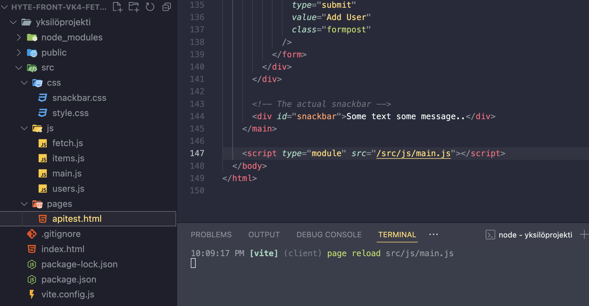
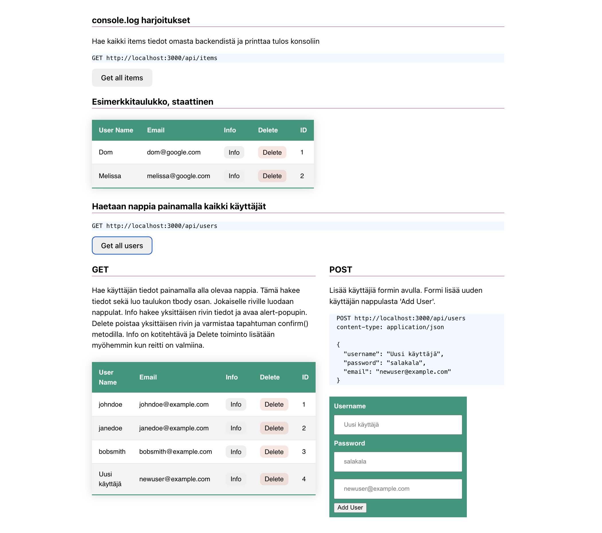

# Fetch API, Rajapintatestaus

Täällä viikolla keskitymme harjoittelemaan rajapintakutsuja. Rakennamme Vite-projektin, jossa haet, lisäät ja poistat käyttäjiä API:sta. Voit tehdä uuden oman pohjan alla olevalla rakenteella tai ottaa valmiiksi [tämän harjoituspohjan](harjoitukset/vk4-apiharjoitus.zip). Muokkaa jälleen pohja kauniimmaksi ja sopivaksi omaan sivustoosi.

Teemme harjoitukset suoraan vite-ympäristöön. Asenna nyt vite kerran uudestaa tätä harjoitusta varten. Laitamme samalla rakenteen sivuilla kuntoon. Luo uudet kansiot css, js ja pages ja siiirä style.css sekä main.js uusi kansioihin. Korjaa myös polut viittaamaan oikeisiin tiedostoihin. Tee myös fetch.js, items.js ja users.js tiedostot. Ne voivat olla kaikki tyhjiä. Testaa, että kaikki toimii ja saat ajettua projektin virheettä.



**fetchtestaus.html** → rajapintaharjoittelun html pohja.<br>
**main.js** → Pääasiallinen aloituspiste, joka yhdistää eri osat (event listenerit, importit jne.).<br>
**fetch.js** → Yleinen tiedosto API-pyyntöjen tekemiseen (uudelleenkäytettävä). <br>
**items.js** → Hoitaa tavaroiden haun, konsoliin tulostamisen.<br>
**users.js** → Hoitaa käyttäjien haun, lisäämisen ja poistamisen sekä UI:n päivittämisen.

**Virheenkäsittely ja viestit**

**Snackbar-viestit** näyttävät onnistumiset ja virheet.<br>
**fetch.js** näyttää virheilmoitukset, jos API kutsu epäonnistuu. Virheilmoitukset tulevat backendin tarjoamasta message objektista.

# Fetch API

1. [Fetch API](https://github.com/ilkkamtk/JavaScript-english/blob/main/apit-ajax.md#fetch-api)
   - Käy läpi JSON ja Fetch API

Fetch API on moderni JavaScript-ohjelmointirajapinta, joka tarjoaa käyttöliittymän verkkopyyntöjen (esim. HTTP-pyyntöjen) tekemiseen web-selaimissa ja Node.js-ympäristöissä. Se on suunniteltu olemaan joustavampi ja tehokkaampi kuin vanhempi XMLHttpRequest.

Fetch API:lla on seuraavat keskeiset piirteet:

1. Yksinkertaisuus ja selkeys: Fetch API käyttää suoraviivaista ja Promisen perusteella toimivaa syntaksia, mikä helpottaa asynkronisten operaatioiden käsittelyä.

2. Promise-pohjainen: Fetch palauttaa Promisen, joka ratkeaa kyseiseen pyyntöön liittyvään Responseen, olipa se onnistunut tai ei.

3. Jäsennellymmät Request- ja Response-objektit: Fetch API esittelee jäsennellymmät Request- ja Response-objektit, mikä mahdollistaa pyyntöjen ja vastausten käsittelyn yhtenäisemmällä tavalla.

Tässä on yksinkertainen esimerkki Fetch API:n käytöstä GET-pyynnön tekemiseen:

```javascript
fetch('https://api.restful-api.dev/objects')
	.then((response) => {
		if (!response.ok) {
			throw new Error('Verkkovastaus ei ollut kunnossa');
		}
		return response.json();
	})
	.then((data) => {
		console.log(data);
	})
	.catch((error) => {
		console.error('Fetch-operaatiossa ilmeni ongelma:', error);
	});
```

Tässä esimerkissä fetch-funktiota käytetään tekemään GET-pyyntö 'https://api.restful-api.dev/objects'. Vastaus tarkistetaan onnistumisen osalta, ja jos se onnistuu, vastauksen JSON-sisältö kirjataan konsoliin.

.catch-lohkoa käytetään käsittelemään mahdolliset fetch-operaation aikana ilmenevät virheet. Fetch on tullut vakiintuneeksi tavaksi tehdä HTTP-pyyntöjä nykyaikaisessa verkkokehityksessä.

# async + await

async ja await ovat JavaScriptin ominaisuuksia, jotka mahdollistavat asynkronisten toimintojen hallinnan ja selkeyttävät asynkronisen koodin kirjoittamista.

**async**: Avainsana, joka määrittelee funktion, joka palauttaa Promise-objektin. Funktion suoritus alkaa normaalisti, mutta mikäli funktiosta palautetaan arvo, se kääritään automaattisesti Promiseen. async-funktioissa voidaan käyttää await-avainsanaa odottamaan toisen async-funktion suorittamisen valmistumista.

**await\***: Avainsana, joka käytetään async-funktion sisällä odottamaan toisen asynkronisen toiminnon, kuten Promise-palauttavan funktion, suorittamisen valmistumista. await-avainsanalla merkitty operaatio "odottaa" sen valmistumista ennen kuin koodin suoritus jatkuu seuraavalla rivillä. await voidaan käyttää vain async-funktioiden sisällä.

Kun käytetään async ja await yhdessä, koodin rakenne muuttuu lineaarisemmaksi ja helpommin ymmärrettäväksi, kun verrataan perinteiseen Promise-pohjaiseen asynkronisen koodin kirjoitustapaan.

Esimerkki async-funktiosta ja await-avainsanan käytöstä:

```javascript
async function getData() {
	try {
		const response = await fetch('https://api.example.com/data');
		const data = await response.json();
		console.log(data);
	} catch (error) {
		console.error('Virhe:', error);
	}
}

getData();
```

Tässä esimerkissä getData on async-funktio, joka käyttää await-avainsanaa odottamaan Fetch API -pyynnön valmistumista ja vastauksen muunnosta JSON-muotoon. Virheiden käsittely tapahtuu try-catch -rakenteessa. Funktio getData kutsutaan sitten suorituksen aloittamiseksi.

## Rakennetaan ensin GET ja POST kutsut

Seuraa luentoa, käymme läpi sekä taulukkojen rakenteen, että itse FETCHin käytön. Valmiiseen pohjaan täytyy pystyä hakemaan kaikki items tiedot sekä users tiedot omasta backendistä. Lisäksi formista täytyy pystyä lisäämään uusi käyttäjä. Mahdolliset virheet sekä onnistumiset tiedon käsittelyssä näytetään sekä konsolissa että tarvittavin toast-viestein käyttäjälle. Viestit jotka käyttäjä näkee on backendin palauttamat response.message tai response.error tiedot.



### Selektorit

Tarvitse monenlaisia uusi selektoreita seuraaviin tehtäviin. Käymme näistä tuntien aika useampaa läpi. Tutki seuraavaa linkkiä.

**Selectors**
https://www.w3schools.com/cssref/css_selectors.php

### CSS muuttujat

Vite on luonut meille projektiin valmiin css pohjan. Tutkimme alkuun hieman pohjaa ja CSS muuttujia. Muokkaa esimerkkisivusi pohjaa niin että vaihdat vihreän perusvärin käyttämään CSS muuttujaa.

**CSS Variables**
https://www.w3schools.com/css/css3_variables.asp

### Data-attribuutti

Data-attribuutit ovat tapa sisällyttää lisätietoja HTML-elementtiin, jotka eivät vaikuta elementin ulkoasuun tai käyttäytymiseen suoraan, mutta jotka voivat olla hyödyllisiä JavaScriptin tai muiden ohjelmointikielten käytössä, jotka manipuloivat HTML-sivua dynaamisesti. Sivupohjassa näet taulukon buttoneissa data-id nimisen attribuutin.

```html
<td><button class="check" data-id="1">Info</button></td>
```

Attribuutteja voidaan käyttää JavaScriptissä tiedon hakemiseen, tarkasteluun tai dynamiseen muuttamiseen.

**HTML data- Attribute**
https://www.w3schools.com/tags/att_data-.asp

### Toast / Snackbar

Toast on pieni, väliaikainen ilmoituskomponentti, joka näkyy yleensä näytön reunassa ja katoaa automaattisesti muutaman sekunnin kuluttua. Se on tyypillisesti käytössä käyttöliittymissä antamaan nopeaa palautetta käyttäjälle ilman, että sivua tarvitsee päivittää.

https://www.w3schools.com/HOWTO/howto_js_snackbar.asp

### Tehtävä 1 - Hae kaikki items tiedot omasta backendistä ja printtaa tulos konsoliin

```http
# Get all items (requires token)
  GET http://127.0.0.1:3000/api/items
```

### Tehtävä 2 - Käyttäjien hakeminen sekä taulukon luominen

Kun painat nappulaa "Hae users tiedot" haetaan tiedot:

```http
# Get all users
  GET http://127.0.0.1:3000/api/users
```

Haetuista tiedoista generoidaan taulukko dynaamisesti DOM metodeilla ja jokaiselle taulukon jäsenelle generoidaan Info sekä Delete button-elementit. Button elementeille lisätään data-attribuuttina käyttäjän ID jatkokäsittelyä varten.

```html
<tr>
	<td>johndoe</td>
	<td>regular</td>
	<td><button class="check" data-id="1">Info</button></td>
	<td><button class="del" data-id="1">Delete</button></td>
	<td>1</td>
</tr>
```

**DOM ja elementtien luominen**

DOM (Document Object Model) on ohjelmointirajapinta, joka esittää dokumentin rakenteen HTML:ssä, XML:ssä tai XHTML:ssä, jotta ohjelmistot voivat muuttaa dokumentin sisältöä, rakennetta ja tyyliä. DOM kuvaa dokumentin kuin puurakenteen, jossa jokainen elementti on solmu.

Elementtien luominen DOM:ssa tarkoittaa uusien HTML- tai XML-elementtien luomista dynaamisesti JavaScriptillä. Tämä voi sisältää uusien elementtien luomisen tyhjästä, niiden muokkaamisen tai lisäämisen olemassa olevaan dokumenttiin. Elementtien luominen DOM:ssa on tärkeä osa dynaamisten verkkosivujen ja sovellusten kehittämistä, koska se mahdollistaa sisällön ja rakenteen luomisen ja muokkaamisen käyttäjän toiminnan perusteella.

1. [DOM](https://github.com/ilkkamtk/JavaScript-english/blob/main/BOM-DOM-event.md#document-interface)
   - Käy läpi DOM osuus ja elementtien luonti

```js
users.forEach((user) => {
	const row = document.createElement('tr');

	row.innerHTML = `
      <td>${user.username}</td>
      <td>${user.email}</td>
      <td><button class="check" data-id="${user.id}">Info</button></td>
      <td><button class="del" data-id="${user.id}">Delete</button></td>
      <td>${user.id}</td>
    `;

	tableBody.appendChild(row);
});
```

### Tehtävä 3 - Käyttäjien lisääminen

Lisää käyttäjiä formin avulla. Formi lisää uuden käyttäjän nappulasta 'Add User'.

```http
  POST http://localhost:3000/api/users
  content-type: application/json

  {
    "username": "Uusi käyttäjä",
    "password": "salakala",
    "email": "newuser@example.com"
  }
```

Saat haettua formista tiedot seuraavasti:

```js
////// main.js

const addUserForm = document.querySelector('.formpost');
addUserForm.addEventListener('click', addUser);

////// users.js

const addUser = async (event) => {

  event.preventDefault();
  const url = 'http://localhost:3000/api/users';

  // Get form values
  const username = document.querySelector('#username').value.trim();
  const password = document.querySelector('#password').value.trim();
  const email = document.querySelector('#email').value.trim();
  ... koodi jatku...
```

### KOTITEHTÄVÄ 4 - Yksittäisen käyttäjän tiedot

Taulukon listan jokaisella jäsenellä on info nappula. Lisää toiminto, jossa "Info" nappulaa painamalla haetaan yksittäisen käyttäjän tiedot. Tähän tarvitse data-attribuutteja.

```http
### get item by id
GET http://localhost:3000/api/users/:id
```

Jokaisella rivillä on tallennettuna id data-attribuuttiin. Voit hakea kyseisen rivin id tiedot esim. seuraavasti:

```js
////// users.js

// Add event listeners for buttons (Info)
const addButtonEventListeners = () => {
	document.querySelectorAll('.check').forEach((button) => {
		button.addEventListener('click', async (event) => {
			const userId = event.target.dataset.id;
			alert(`Showing info for user ID: ${userId}`);
			// TODO: Fetch more info or show user details here
		});
	});
};
```

Tiedot näytetään käyttäjälle alert ponnahdusikkunassa.
