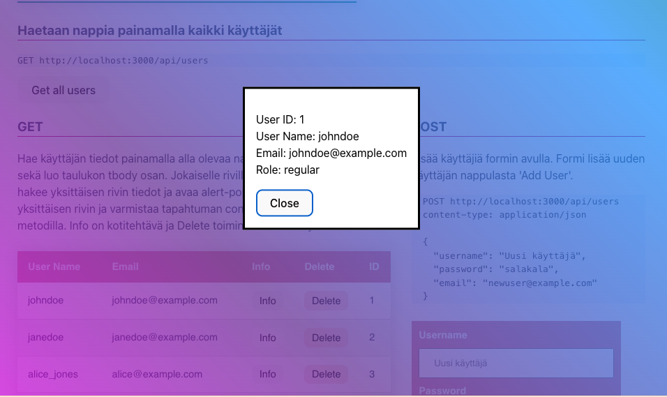
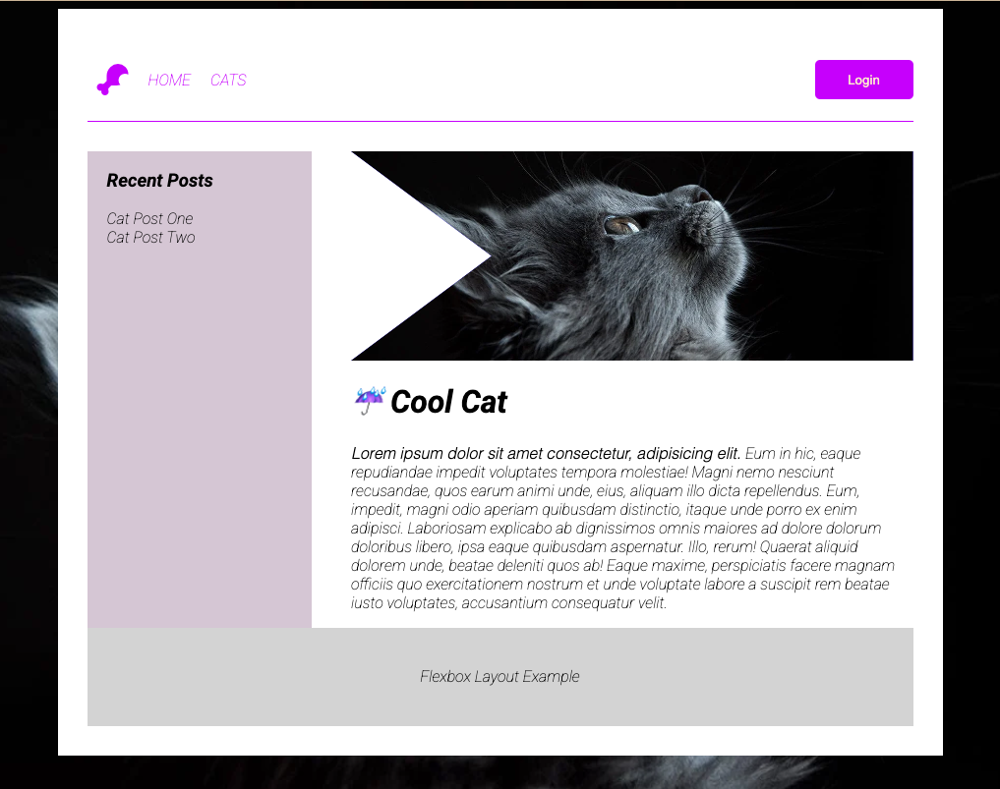
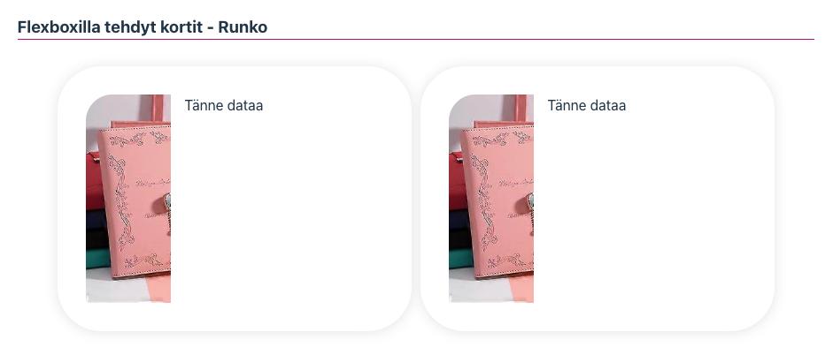
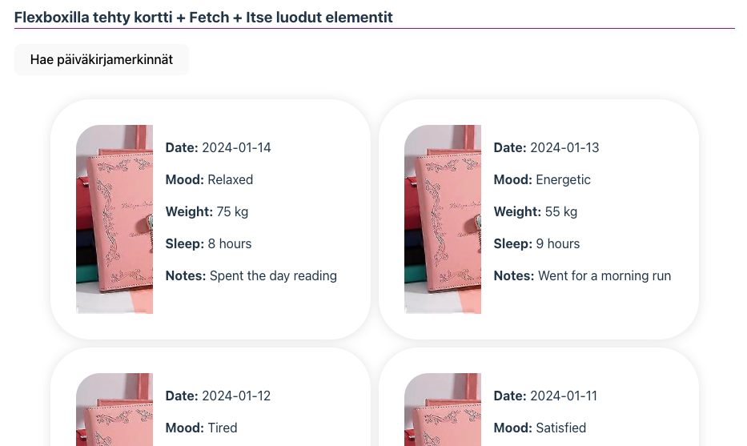

# Rajapintahakujen jatko ja Flexbox

### Modaalit ja Dialogit

**Tutkitaan ensin perus Modaaleja**

https://www.w3schools.com/howto/howto_css_modals.asp

Modaalien kanssa on perinteisesti ollut jonkunverran hankaluuksia, kuten se, että modaalin tausta yhä scrollaantuu vaikkakin käyttäjällä on modaal auki. Näytän tästä tunnilla pari esimerkkiä. Modaaleja korvaamaan on lähivuosina kehitetty uusi html elemenentti **dialog** joka tarjoaa natiivin tuen modaaleille.

**Dialog**

https://developer.mozilla.org/en-US/docs/Web/HTML/Element/dialog

Käytämme tänään dialogin luomiseen valmista koodia hieman muunneltuna. Dialogin avaamiseen, kuten modaalien tarvitsen hippasen JS koodia. Katso alla oleve CodePen esimerkki.

- https://css-tricks.com/how-to-implement-and-style-the-dialog-element/
- Lue tämä myös tarkkaan: https://developer.mozilla.org/en-US/docs/Web/API/HTMLDialogElement

Lisätään Dialogille myös Backdrop ominaisuus.

- https://css-tricks.com/almanac/selectors/b/backdrop/ <br>
- https://codepen.io/chergav/pen/zYYbjaE
  <br>

Lisää seuraavat rivit html sivuillesi:

```html
    <dialog class="info_dialog">
      <p>
        <!-- tähän täytetään käyttäjän tiedot -->
        <!-- # Get user by id -->
        <!-- GET http://127.0.0.1:3000/api/users/1 -->


        <div>UserID: <span>Id</span></div>
        <div>UserName: <span>Username</span></div>
        <div>Email: <span>Email</span></div>
        <div>Role: <span>Role</span></div>
      </p>
      <button autofocus>Close</button>
    </dialog>
```

Lisätään nyt kaikille käyttäjien listan jäsenille "Info" nappuloille tapahtumankuuntelijat. Kun nappulaa klikataan, haetaan yksittäisen käyttäjän tiedot taustapalvelusta id perusteella. Voit tehdä erilaisen toteutuksen seuraten viime viikon tehtävää. Pääasia, että haet yhden käyttäjän tiedot ja saat haettua ne dialogiin.

```js
const dialog = document.querySelector('.info_dialog');
const closeButton = document.querySelector('.info_dialog button');
// "Close" button closes the dialog
closeButton.addEventListener('click', () => {
	dialog.close();
});

const addEventListeners = () => {
	document.querySelectorAll('.check').forEach((button) => {
		button.addEventListener('click', async (event) => {
			console.log('Klikkasit nappulaa:', event.target);
			// get id with data-attribute
			// or use a hidden input field in table
			const userId = event.target.dataset.id;
			console.log('Haetaan tietoja käyttäjälle id:llä:', userId);

			// Fetch user details
			const user = await getUserById(userId);

			if (user) {
				// open modal
				dialog.showModal();
				dialog.querySelector('p').innerHTML = `
          <div>User ID: <span>${user.user_id}</span></div>
          <div>User Name: <span>${user.username}</span></div>
          <div>Email: <span>${user.email}</span></div>
          <div>Role: <span>${user.user_level}</span></div>`;
			}
		});
	});
};
```

Tyylittele dialogi ja katso että kaikki tiedot tulostuvat dialogiin.



## Flexbox

Flexbox on CSS3:n osa, joka tarjoaa tehokkaan tavan järjestellä ja hallita elementtejä rivi- ja sarakemuodostelmissa joustavasti ja dynaamisesti. "Flexbox" tulee sanasta "Flexible Box", mikä kuvaa sen kykyä mukautua erilaisiin näyttökoon muutoksiin ja sisällön määriin. Flexbox on erityisen hyödyllinen silloin, kun halutaan luoda responsiivisia ja monipuolisia käyttöliittymiä verkkosivuille tai web-sovelluksiin.

Flexboxin avulla voit määrittää, miten elementit järjestellään, sijoitetaan, venytetään ja kutistetaan suhteessa toisiinsa ja niiden ympäristöön. Flexboxin pääperiaatteita ovat joustavuus, suhteellisuus ja helppokäyttöisyys verrattuna perinteisiin CSS-menetelmiin.

[Loistava Flexbox tietosivu : A Complete Guide to Flexbox](https://css-tricks.com/snippets/css/a-guide-to-flexbox/)

Joitakin tärkeitä käsitteitä ja ominaisuuksia Flexboxissa ovat:

**_Flex Container_**: Elementti, joka sisältää flex-item-elementtejä. Tämä määritellään asettamalla CSS-ominaisuus display: flex; tai display: inline-flex; elementille, jonka haluat toimivan flex-containerina.

**_Flex Items_**: Elementit, jotka ovat suora lapsia flex-containerista ja joihin Flexbox-ominaisuudet vaikuttavat. Ne asettuvat joustavasti flex-containerin sisällä.

**_Main Axis ja Cross Axis_**: Flexboxilla on kaksi pääakselia, pääakseli (main axis) ja poikkeusakseli (cross axis), jotka määritellään flex-containerin suuntaan (flex-direction). Pääakseli on oletuksena vaakasuora ja poikkeusakseli pystysuora.

**_Justify Content_**: Ominaisuus, joka määrittää flex-itemien sijoittelun pääakselin suunnassa flex-containerissa.

**_Align Items ja Align Content_**: Ominaisuudet, jotka määrittävät flex-itemien ja flex-containerin välistä sijoittelua poikkeusakselin suunnassa.

**_Flex Grow, Flex Shrink ja Flex Basis_**: Ominaisuudet, jotka määrittävät flex-itemien joustavuuden ja niiden käyttäytymisen suhteessa toisiinsa.

Flexbox tarjoaa monipuolisia mahdollisuuksia layoutien hallintaan ja on tullut yhdeksi tärkeimmistä työkaluista responsiivisen suunnittelun ja joustavien käyttöliittymien toteuttamisessa verkkokehityksessä.

Harjoittelemme aamun tunneila näitä käsitteitä yhdessä, vanhan tutun asemointitehtävän avulla:

[Laatikkoleikki](tuntiesimerkit-pohjat/vk1-asemointi-pohja/asemointi.html)

Harjoittelemme tekemään vastaavanlaisen layoutin yhdessä:



### Tehtävä 1 - Kortit

Alla on kuvankaappaus kahdesta kortista. Korttien asemointi on tehty puhtaasti hyödyntäen Flexbox layout moduulia. Lisää api-harjoituspohjaan tai halutessasi luo uusi sivu johon haet taustapalvelusta käyttäjän päiväkirjamerkinnät ja luot niille tarvittavan määrän kortteja. Luomisessa ja asemoinnissa käytä aamulla oppimaasi eli Flexbox-layout ominaisuuksia. Voit käyttää korteissa omaa tyylittelyä. Luo ensin flexboxin avulla staattisesti yhden kortin runko. Vasemmalle laita joku täyttökuva, oikealle tulee laittaa itse merkinnät.

```html
<h3>Flexboxilla tehdyt kortit - Runko</h3>
<!-- kortit sisältävä flex parent -->
<section class="card-area">
	<!-- yksittäinen kortti -->
	<div class="card">
		<!-- vasen puoli jossa kuva -->
		<div class="card-img">
			
		</div>

		<!-- oikea puoli jossa päiväkirjamerkintä-->
		<div class="card-diary">
			<!-- tänne myös flexbox rakenne -->
			Tänne dataa
		</div>
	</div>
</section>
```



### Tehtävä 2 - Fetch omasta rajapinnasta + Itse luodut elementit

Seuraavaksi yhdistä kaikki edellä opittu. Jos rajapintasi ei vielä toimi voit alkuun hakea korttien tekstisisällön tiedostosta. Luo **diary.json** niminen tiedosto projektiisi ja siirrä se **public** kansioon ja tee fetch suoraan tiedostoon. Vite ei osaa tarjota staattisia tiedostoja src kansiosta. Viittaa publick kansion json tiedostoon samoin kuin kuviin. Näin voit käyttää mokkidataa ilman toimivaa rajapintaa.

```js
const url = '/diary.json';
const items = await fetchData(url);
```

```json
// väliaikainen testidata
[
	{
		"entry_id": 5,
		"user_id": 5,
		"entry_date": "2024-01-14",
		"mood": "Relaxed",
		"weight": 75.0,
		"sleep_hours": 8,
		"notes": "Spent the day reading",
		"created_at": "2024-01-14T19:00:00"
	},
	{
		"entry_id": 4,
		"user_id": 4,
		"entry_date": "2024-01-13",
		"mood": "Energetic",
		"weight": 55.0,
		"sleep_hours": 9,
		"notes": "Went for a morning run",
		"created_at": "2024-01-13T18:00:00"
	},
	{
		"entry_id": 3,
		"user_id": 3,
		"entry_date": "2024-01-12",
		"mood": "Tired",
		"weight": 68.0,
		"sleep_hours": 6,
		"notes": "Work was demanding",
		"created_at": "2024-01-12T22:00:00"
	},
	{
		"entry_id": 2,
		"user_id": 2,
		"entry_date": "2024-01-11",
		"mood": "Satisfied",
		"weight": 65.0,
		"sleep_hours": 7,
		"notes": "Met with friends, had a good time",
		"created_at": "2024-01-11T21:00:00"
	},
	{
		"entry_id": 1,
		"user_id": 1,
		"entry_date": "2024-01-10",
		"mood": "Happy",
		"weight": 70.5,
		"sleep_hours": 8,
		"notes": "Had a great workout session",
		"created_at": "2024-01-10T20:00:00"
	}
]
```

Luo seuraavaksi edellisen tehtävän kortit käyttäen DOM elementtien luomista. Kortit on siis luotava kokonaan javascriptin avulla.

```html
<h3>Flexboxilla tehty kortti + Fetch + Itse luodut elementit</h3>

<button class="get_entries">Hae päiväkirjamerkinnät</button>
<section class="card-area2"></section>
```

**HUOM** kun oma rajapintasi on valmis ja entries endpoint toimii, hae kortteihin tieto käyttäen API kutsua:

```http
# Get all entries
GET http://localhost:3000/api/entries
```

Vinkki: Tähän elementtien generoimiseen voit helposti käyttää chatgpt ym apureita. Anna toivottu html koodi ja pyydä tekoälyä kirjoittamaan elementtien luominen js:n avulla. Tarkista kuitenkin että generoitu koodi on järkevää.


